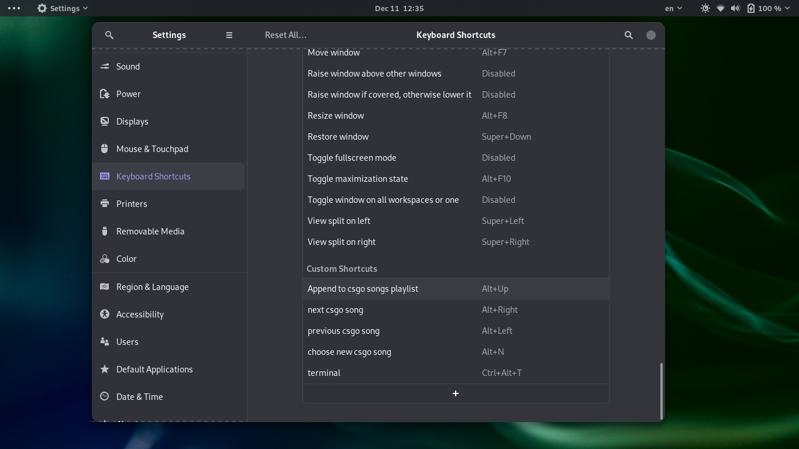

# csgo_st
Counter Strike: Global Offensive Song Transmitter

# Dependencies

*sox*

*sed*

*wc*

*zenity*

## Disclaimer

*csgo_st* is not a cheat and will not get you banned.

That said, I'm in no way responsible for your getting banned.

If you ever do please do not blame it on csgo_st.

# Usage

-d: default behaviour, choose songs and play them(discards the previous playlist)

-a: append, Append to the current songs list

-n: next song, Play the next song (converts the next song in playlist so that it is playable in game when the / bind key is pressed)

-p: Previous song, Play the previous song 

-w: Write cfg, Writes the necessary config file in csgo config directory(only needs to be done once)

# Ingame Usage
Type `exec csgo_st` in console to enable csgo_st

Type `track` in console to view the current song both in console and in chat

Type `tracks` in console to view your playlist in console
`tracks` also calls `track` and tells you the current song

Press forward slash `/` to play the song or stop it after it has started playing

When the song is playing you cannot use your microphone in game.

if you ever accidentally press your microphone bind key (the default is K; V is also popular),
you will need to press slash to start and stop the song before trying to talk

# Tips

You can automate enabling csgo_st by putting this line in your autoexec.cfg or other config file you automatically load on game start
`exec csgo_st`

You can take advantage of **keyboard shortcuts** your shell provides.

As an example I'll show how to configure keyboard shortcuts in GNOME:

Here are some other keyboard shortcuts:

# Todo
1. Load CSGO_PATH and Bind Toggle Key from a config file if available
2. Complete the Dependencies list
3. Optionally add lib notify
4. Create a simple man page and add a -h help option to the script

# So excited you want to donate?

OK :) I accept your kind csgo gifts: 

[My trade link](https://steamcommunity.com/tradeoffer/new/?partner=346596271&token=ZPr4yfuh)

[My profile](https://steamcommunity.com/id/MR_0099/)
